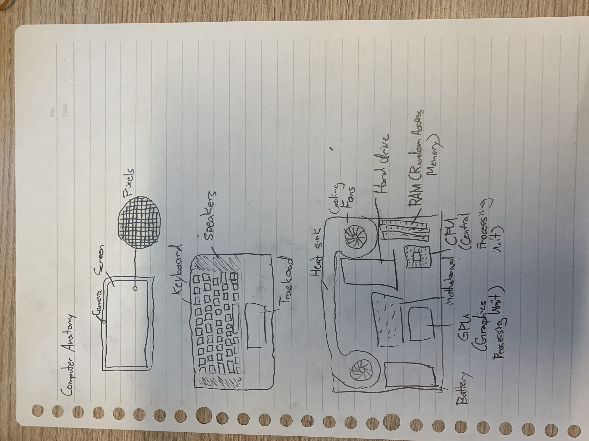

#Lesson 2 - github mark down file
Test file with special formating. These are noted by .md
## First picture of a computer

**Fig 1.** First try at drawing computer parts

In **Fig 1.** This was my first attempt at drawing the insides of a computer. I know some basic components, but I don't know how they interact (where they go in the computer).
