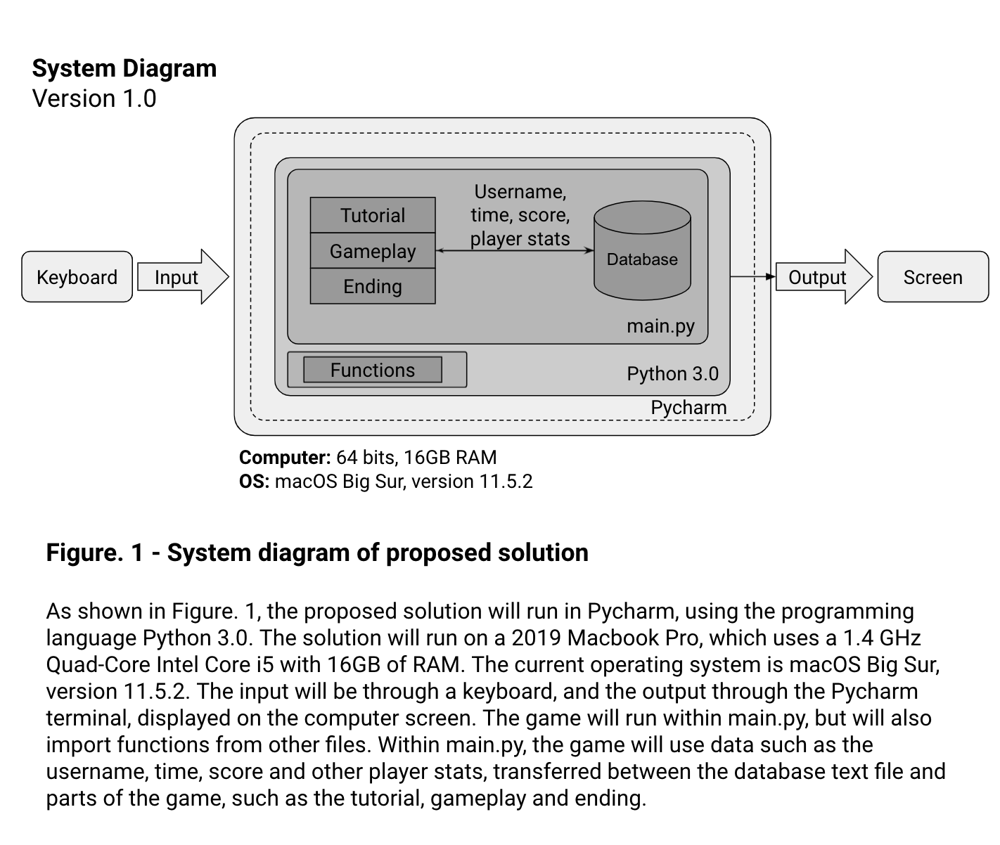
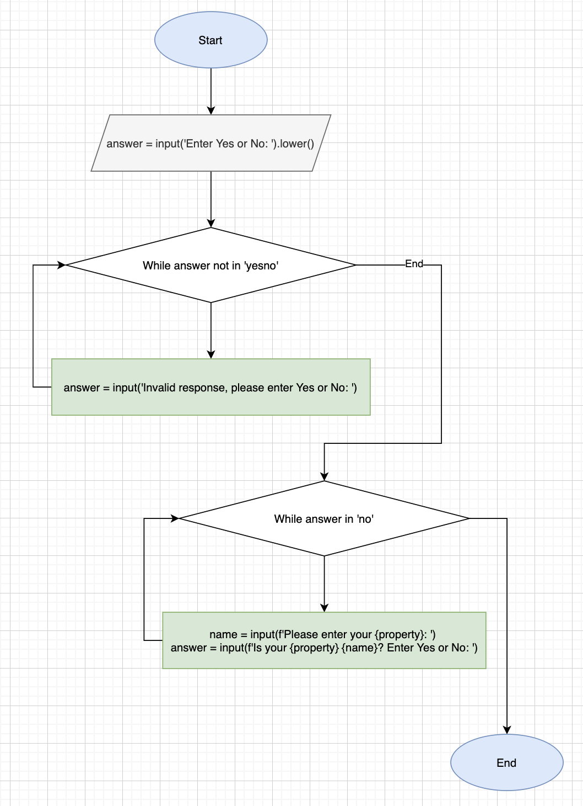
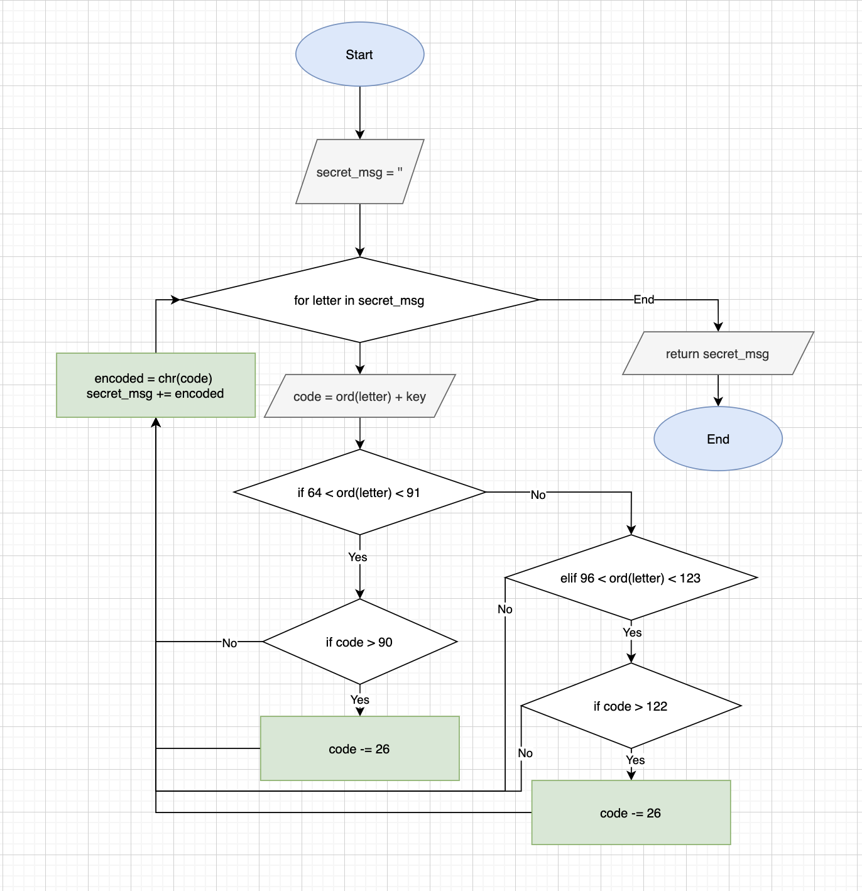
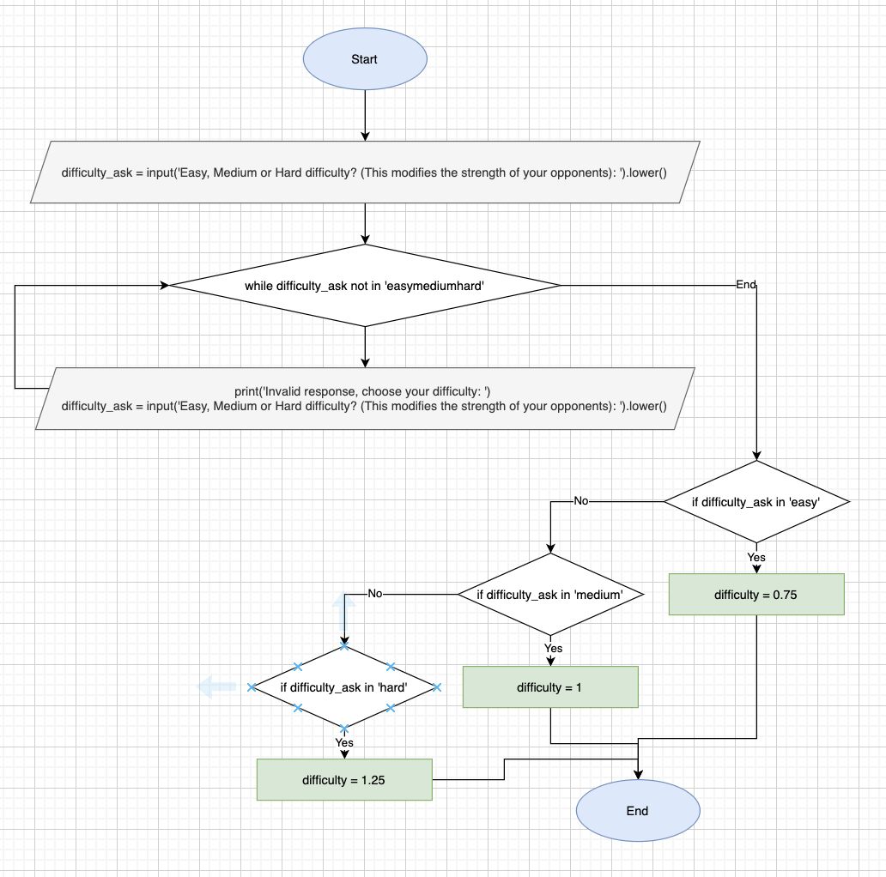

# Unit 1: A classic game 

# Criteria A: Planning

## Problem definition

The owner of the local game shop is an enthusiast of classic computer games. He has been looking for a talented programmer that can help him revive his passion for text-based games. He has few requirements for this task:

1. The game has to be entirely text-based.
2. The game must record the time played.
3. The game must record the player name and score.

Apart for this requirements, the owner is open to any type of game, topic or genre.

## Proposed Solution

I will design and make a text based game for a client who is the owner of a local game shop. The game will be a dungeon crawler/role playing game, and will be constructed in the application Pycharm using the software Python 3.0. It will take 3 weeks to make and will be evaluated according to the following criteria: The game must be entirely text based, it must record the time played, and it must record the player name and score.

The reason I will be using the computer language Python is because it is a widely used language, and can run on most platforms. Therefore, this game will be easily accessible.

## Success Criteria

1. The game will be entirely text based.
2. The game will record the player's name and score.
3. The game will record the time played.
4. The game will have enemies for the player to fight and weapons to fight with.
5. The game will have a game menu to allow the player to specify difficulty level.
6. The game will have a health system that will cause the player to lose the game if all the health is depleted.

# Criteria B: Design

## System Diagram

## Flow Diagrams

### confirm_input function

### encoder function

### confirm_difficulty

## Record of Tasks
|    | Planned Action                                                  | Planned Outcome                                                                                                                                                                                        | Time estimate | Target completion date | Criterion |
|----|-----------------------------------------------------------------|--------------------------------------------------------------------------------------------------------------------------------------------------------------------------------------------------------|---------------|------------------------|-----------|
| 1  | Write Success Criteria                                          | Specify some minimum requirements of the proposed solution                                                                                                                                             | 10 min        | 23 September 2021      | A         |
| 2  | Create System Diagram                                           | Gain a clear idea of the hardware and software requirements for the proposed solution                                                                                                                  | 10 min        | 7 October 2021         | B         |
| 3  | Create a encryption function for the user data                  | A tested function that uses the caesar cypher.                                                                                                                                                         | 20 min        | 7 October 2021         | C         |
| 4  | Integrate encryption into a database to protect user data       | A database that can store user information and encode it.                                                                                                                                              | 10 min        | 7 October 2021         | C         |
| 5  | Create a function for encoding the database                     | A tested function that encodes the database                                                                                                                                                            | 10 min        | 7 October 2021         | C         |
| 6  | Unit Test: function for encoding with the Caesar cypher         | Check if function works. Test with input "Hello" and key 1. Output should be 'Ifmmp'                                                                                                                   | 5 min         | 9 October 2021         | C         |
| 7  | Write proposed solution                                         | Specify the requirements and needs of the client, gain an understanding of the minimum conditions of the solution                                                                                      | 10 min        | 9 October 2021         | A         |
| 8  | Create introduction for game                                    | Create the menu and introduction of the game, allowing the user to save their name and begin a new game                                                                                                | 120 min       | 10 October 2021        | C         |
| 9  | Create function for confirming input                            | A reusable function to confirm an input from the user                                                                                                                                                  | 10 min        | 16 October 2021        | C         |
| 10 | Create a system to append user data to database                 | Make sure important player information such as name, score and time can be saved even after game finishes running                                                                                      | 5 min         | 16 October 2021        | C         |
| 11 | Create function for generating a random number in a range       | A reusable function for the luck or random aspects of the game                                                                                                                                         | 10 min        | 16 October 2021        | C         |
| 12 | Play test introduction                                          | Check for bugs, and use feedback from play tester to make game either more fun or easier to follow                                                                                                     | 20 min        | 17 October 2021        | E         |
| 13 | Bug fixes                                                       | Fix bugs and make improvements to game based on play tested feedback                                                                                                                                   | 60 min        | 18 October 2021        | C         |
| 14 | Create function for the fight sequences                         | A reusable function, using data specific to the enemy the player has to face, to generate a random sequence for the player to fight an enemy.                                                          | 180 min       | 20 October 2021        | C         |
| 15 | Play test introduction, which now includes first fight sequence | Check for bugs, and use feedback from play tester to make game either more fun or easier to follow. Additionally follow up on previous feedback from play tester, to see if improvements are adequate. | 20 min        | 20 October 2021        | E         |
| 16 | Bug fixes                                                       | Fix bugs and make improvements to game based on new play tested feedback                                                                                                                               | 40 min        | 21 October 2021        | C         |
| 17 | Update System Diagram                                           | Make sure the System Diagram includes all new changes since last update                                                                                                                                | 20 min        | 22 October 2021        | B         |
| 18 | Create flow diagrams for 3 functions                            | 3 visual diagrams to explain the logic behind 3 elements of the game                                                                                                                                   | 60 min        | 23 October 2021        | B         |
